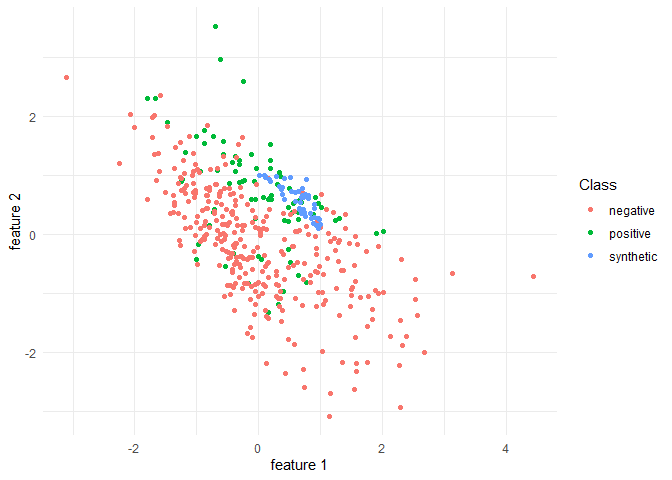

Synthetic graph
================
Andrea Zoccatelli
2023-07-01

``` r
library(GenCopula)
```

``` r
sel_path = "D:/unibg/APP"
sel_filename = "BestCase.csv"
```

``` r
DB = import_strat_split(sel_path, sel_filename)
id = stratify(DB@train_set)
minority = extract_minority(DB@train_set)
index = best_copula(dplyr::select(DB@train_set, -c(id,y)))

train_a = augment(DB@train_set, index, minority, share = 0.6, outliers_r = 1, nearest = 1)

train_a = train_a %>% mutate(data = ifelse(is.na(id),"synthetic",ifelse(y == 1,"positive","negative")))
```

``` r
train_a %>% ggplot()+
  geom_point(aes(feature.1, feature.2, colour = data))+
  #ggtitle("Synthetic vs Real Observations")+
  xlab("feature 1")+
  ylab("feature 2")+
  labs(color='Class')+
  theme_minimal()
```

<!-- -->
